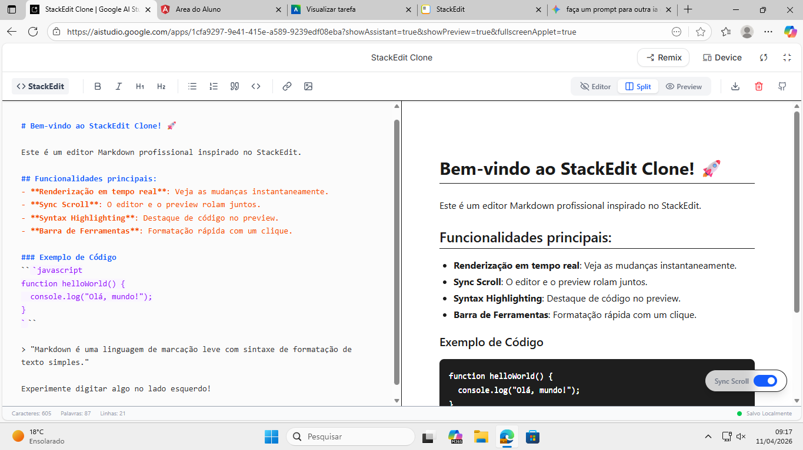

# 🚀 StackEdit Clone — Engenharia Reversa Assistida por IA

Projeto acadêmico desenvolvido com foco em Engenharia de Prompt, Desenvolvimento Assistido por IA e reconstrução de interfaces modernas através de análise visual e funcional.

---

# 📚 Sobre o Projeto

O objetivo desta atividade foi recriar uma aplicação inspirada no editor markdown **StackEdit**, utilizando apenas observação visual da interface e descrição funcional do comportamento do sistema, sem acesso ao código-fonte original.

A proposta explora conceitos modernos de:

- Engenharia Reversa
- Desenvolvimento Assistido por IA
- Prompt Engineering
- Prototipagem Front-end
- Interfaces SPA (Single Page Application)

---

# 🧠 Objetivo da Atividade

Reconstruir uma aplicação funcional semelhante ao StackEdit utilizando IA como assistente de desenvolvimento.

O projeto foi desenvolvido a partir da análise visual da interface original, mapeando:

- Componentes visuais
- Layout
- Fluxos de interação
- Regras de comportamento
- Funcionalidades principais

---

# 🛠️ Tecnologias Utilizadas

- HTML5
- Tailwind CSS
- JavaScript
- Markdown
- marked.js
- Engenharia de Prompt
- Google AI Studio
- IA Generativa

---

# 🎨 Funcionalidades Implementadas

## ✅ Layout Split-Screen

A aplicação possui uma interface dividida verticalmente:

- Editor Markdown no lado esquerdo
- Preview HTML renderizado no lado direito

---

## ✅ Barra de Ferramentas Superior

Inclui ações rápidas para:

- Negrito
- Itálico
- Listas
- Links
- Imagens
- Alternância de visualização

---

## ✅ Renderização Markdown em Tempo Real

O conteúdo digitado no editor é convertido automaticamente para HTML utilizando a biblioteca:

```txt
marked.js
```

---

## ✅ Scroll Sincronizado

O preview acompanha proporcionalmente a rolagem do editor markdown.

---

## ✅ Estética Moderna e Clean

O projeto utiliza:

- Fundo acinzentado no editor
- Preview branco
- Fonte monospace para edição
- Fonte sans-serif para leitura
- Interface minimalista

---

# 🧩 Prompt Utilizado

```txt
Atue como um desenvolvedor Front-end sênior. Crie uma aplicação web de página única (SPA) inspirada no StackEdit utilizando HTML5, Tailwind CSS e JavaScript puro (ou React).

Requisitos de Design e Layout:

Layout Split-Screen: A tela deve ser dividida verticalmente em duas partes iguais. O lado esquerdo é o editor de texto (input) e o lado direito é a visualização (preview).

Barra de Ferramentas Superior: Inclua uma barra fixa com ícones para formatação básica (Negrito, Itálico, Listas, Links, Imagens) e um botão para alternar o modo de visualização.

Estética Clean: Use uma paleta de cores moderna (fundo levemente acinzentado para o editor, branco puro para o preview) e tipografia legível (monospace para o editor, sans-serif para o preview).

Requisitos Funcionais:

Renderização em Tempo Real: Conforme o usuário digita Markdown no lado esquerdo, o lado direito deve atualizar instantaneamente o HTML renderizado.

Suporte a Markdown: Utilize uma biblioteca leve (como marked.js) para converter o Markdown em HTML.

Sync Scroll: Implemente uma funcionalidade básica de 'scroll sincronizado': quando eu rolar o editor, o preview deve acompanhar a posição proporcionalmente.

Destaque de Sintaxe: Se possível, adicione syntax highlighting básico no campo de entrada.
```

---

# 📸 Resultado Gerado



---

# 🔍 Reflexão Sobre Desenvolvimento Assistido por IA

Diante de uma inovação como essa, é extremamente importante que os desenvolvedores se adaptem às novas tecnologias para que não se tornem obsoletos no mercado.

Ferramentas de IA já conseguem acelerar significativamente:

- criação de interfaces,
- prototipagem,
- geração de componentes,
- organização estrutural,
- automação de código repetitivo.

Por isso, torna-se fundamental que o desenvolvedor moderno saiba:

- criar prompts eficientes,
- estruturar requisitos técnicos,
- validar resultados,
- corrigir inconsistências,
- supervisionar o comportamento da IA.

O profissional deixa de atuar apenas como programador manual e passa a assumir um papel mais estratégico e analítico dentro do desenvolvimento de software.

---

# ⚖️ Engenharia Reversa, Ética e Plágio Digital

A engenharia reversa assistida por IA pode ser uma ferramenta extremamente útil para:

- aprendizado,
- estudos acadêmicos,
- inspiração visual,
- análise de UX/UI,
- prototipagem rápida.

Entretanto, a prática se torna problemática quando há:

- cópia excessiva da identidade visual,
- reprodução integral da experiência original,
- reutilização comercial sem transformação significativa.

Ao meu ver, o uso ético da IA no desenvolvimento só é válido quando utilizado como apoio para ideias originais e processos criativos legítimos.

Mesmo com os avanços das inteligências artificiais, o desenvolvimento humano continua sendo essencial devido à criatividade, tomada de decisão e inovação genuína que ainda dependem da interpretação humana.

Acredito também que, futuramente, as IAs receberão mecanismos mais avançados de detecção contra plágio, reduzindo reproduções excessivamente semelhantes de aplicações já existentes.

---

# 👨‍💻 Autor

Projeto acadêmico desenvolvido para estudos de:

- Engenharia de Prompt
- Desenvolvimento Assistido por IA
- Engenharia Reversa
- Front-end Moderno

---

# 📄 Licença

Projeto desenvolvido exclusivamente para fins educacionais e acadêmicos.

[⬆ Voltar ao início](#-sobre-o-projeto)
